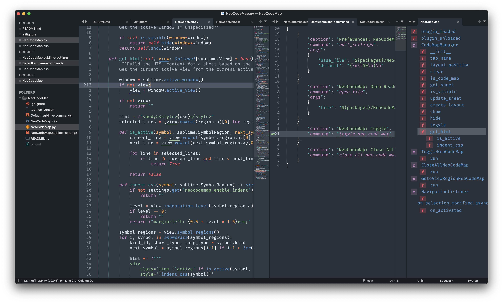

# NeoCodeMap

This plugin is inspired by [sublime-codemap](https://github.com/oleg-shilo/sublime-codemap/tree/master) but using Sublime Text 4 capabilities.

It displays on the side of the editor. You can jump to symbol definition and references to it.

It supports all languages through native Sublime indexing.

# Installation

This plugins has only been tested on Sublime Text >= 4200.

## Package Control

Ongoing

## Manual install

Clean repository in your `Packages` directory.

# Command Palette

Press `cmd+shift+p`. Type `neocodemap` to see the available commands:

* **Toggle**: Toggle the code map view
* **Close All**: Close all code maps on all windows
* **Move Up**: Move to the next symbol on the current view
* **Move Down**: Move to the previous symbol on the current view
* **Preferences**: Edit preferences (see below)

# Preferences

You can configure the plugin to use:

| Preference            | Description                                                                                                                                     | Default |
|-----------------------|-------------------------------------------------------------------------------------------------------------------------------------------------|---------|
| neocodemap_width      | Set the default width of the codemap column The value is a percentage of the layout It should be compride between 0 and 1 where 1 is 100% | 0.20    |
| neocodemap_position   | Position of the codemap    - auto: opposite position of the sidebar    - left: on left    - right: on right                            | auto    |
| neocodemap_max_indent | Choose the maximum indentation level to display Using a negative value disables the limit                                                    | -1      |